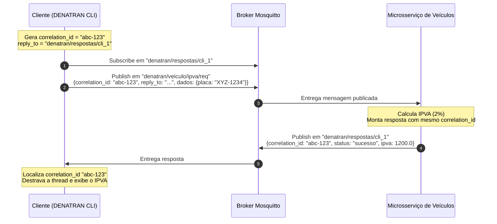

# Guia Completo e Documentação Técnica: Sistema Distribuído DENATRAN com Microsserviços e MQTT

> **Disciplina:** Sistemas Distribuídos — Universidade Federal de Sergipe (UFS)  
> **Linguagem Alvo:** Python 3.10+  
> **Protocolo de Comunicação:** MQTT (Message Queuing Telemetry Transport)  
> **Broker:** Eclipse Mosquitto  
> **Conteinerização:** Docker & Docker Compose  

---

## Sumário
1. [Visão Geral e Contextualização do Sistema](#1-visão-geral-e-contextualização-do-sistema)
2. [Fundamentação Teórica das Bibliotecas e Ferramentas](#2-fundamentação-teórica-das-bibliotecas-e-ferramentas)
   - [2.1 Protocolo MQTT e Eclipse Mosquitto](#21-protocolo-mqtt-e-eclipse-mosquitto)
   - [2.2 paho-mqtt (Python)](#22-paho-mqtt-python)
   - [2.3 sqlite3 (Persistência por Serviço)](#23-sqlite3-persistência-por-serviço)
   - [2.4 json e uuid (Serialização e Correlação)](#24-json-e-uuid-serialização-e-correlação)
   - [2.5 threading e concurrent.futures (Sincronismo Cliente)](#25-threading-e-concurrentfutures-sincronismo-cliente)
3. [Arquitetura de Microsserviços](#3-arquitetura-de-microsserviços)
   - [3.1 Divisão dos Serviços](#31-divisão-dos-serviços)
   - [3.2 O Desafio Request-Reply sobre Pub/Sub](#32-o-desafio-request-reply-sobre-pubsub)
   - [3.3 Diagrama de Arquitetura e Comunicação](#33-diagrama-de-arquitetura-e-comunicação)
4. [Design Detalhado dos Tópicos e Payloads (Contrato de Mensageria)](#4-design-detalhado-dos-tópicos-e-payloads-contrato-de-mensageria)
5. [Modelagem dos Dados por Microsserviço](#5-modelagem-dos-dados-por-microsserviço)
6. [Estrutura de Pastas e Arquivos do Projeto](#6-estrutura-de-pastas-e-arquivos-do-projeto)
7. [Guia de Implementação Passo a Passo (com Código de Referência)](#7-guia-de-implementação-passo-a-passo-com-código-de-referência)
   - [7.1 Módulo Compartilhado: `common/mqtt_helper.py`](#71-módulo-compartilhado-commonmqtt_helperpy)
   - [7.2 Microsserviço de Condutores: `services/condutores_service.py`](#72-microsserviço-de-condutores-servicescondutores_servicepy)
   - [7.3 Microsserviço de Veículos & IPVA: `services/veiculos_service.py`](#73-microsserviço-de-veículos--ipva-servicesveiculos_servicepy)
   - [7.4 Microsserviço de Multas: `services/multas_service.py`](#74-microsserviço-de-multas-servicesmultas_servicepy)
   - [7.5 Cliente / Gateway Interativo: `client/cli.py`](#75-cliente--gateway-interativo-clientclipy)
8. [Configuração de Docker e Docker Compose](#8-configuração-de-docker-e-docker-compose)
9. [Roteiro de Testes e Validação de Todos os Requisitos](#9-roteiro-de-testes-e-validação-de-todos-os-requisitos)
10. [Pegadinhas Clássicas e Boas Práticas em Sistemas Distribuídos](#10-pegadinhas-clássicas-e-boas-práticas-em-sistemas-distribuídos)
11. [Modelo Mental Para Iniciantes: A Metáfora dos Correios e Guichês](#11-modelo-mental-para-iniciantes-a-metáfora-dos-correios-e-guichês)
12. [Guia Zero to Hero: Como Criar as Pastas e Arquivos (PowerShell e Bash)](#12-guia-zero-to-hero-como-criar-as-pastas-e-arquivos-powershell-e-bash)
13. [Anatomia Didática do Código: O que Cada Linha 'Estranha' Faz](#13-anatomia-didática-do-código-o-que-cada-linha-estranha-faz)
14. [Modo Raio-X: Como Espionar o Tráfego MQTT em Tempo Real](#14-modo-raio-x-como-espionar-o-tráfego-mqtt-em-tempo-real)
15. [Execução Local no Windows sem Docker (Plano B)](#15-execução-local-no-windows-sem-docker-plano-b)

---

## 1. Visão Geral e Contextualização do Sistema

O objetivo da atividade é projetar e implementar um sistema distribuído para o **DENATRAN (Departamento Nacional de Trânsito)** capaz de centralizar e coordenar as informações veiculares e de condutores de todos os DETRANs do país.

### 1.1 Requisitos Funcionais Exigidos
1. **Cadastrar Condutor:** Registro de condutores com `CPF` e `Nome`.
2. **Emplacar Veículo:** Registro de veículo com `Placa`, `Modelo`, `Valor`, `CPF do condutor` e `Ano de Emplacamento`.
3. **Calcular IPVA:** Cálculo do imposto com alíquota fixa de **2%** sobre o valor venal do veículo (`Valor * 0.02`), indexado pela `Placa`.
4. **Transferir Proprietário:** Atualização do proprietário do veículo (`Placa` e `CPF do novo dono`), validando a existência do novo condutor.
5. **Lançar Multa:** Registro de infração com `Ano`, `Descrição`, `Pontuação` e `Placa do veículo`. O sistema deve associar a multa ao condutor que era proprietário do veículo no momento da infração.
6. **Informar Veículos Emplacados em um Ano:** Consulta filtrada pelo `Ano`.
7. **Informar Multas por Veículo em um Ano:** Consulta por `Placa` (e opcionalmente `Ano`), trazendo o histórico de infrações e os dados do condutor penalizado.
8. **Informar Multas de um Condutor em um Ano:** Consulta por `CPF do condutor` e `Ano`.
9. **Informar Multas Lançadas em um Ano:** Consulta geral de infrações pelo `Ano`.
10. **Top 5 Condutores com Maiores Pontuações de Multas:** Relatório ranqueado em ordem decrescente dos 5 motoristas com maior acúmulo de pontos na CNH.

### 1.2 Restrições Arquiteturais
- **Microsserviços:** Cada serviço deve ter responsabilidade delimitada e gerenciar seu próprio estado/dados (evitando acoplamento de banco de dados).
- **Barramento MQTT:** Toda comunicação inter-serviços e cliente-serviço deve trafegar por um Message Broker MQTT.
- **Docker & Compose:** Execução e testes orquestrados via containers.

---

## 2. Fundamentação Teórica das Bibliotecas e Ferramentas

Para construir uma solução robusta e justificar cada escolha no relatório ou apresentação, é essencial compreender a teoria por trás das tecnologias utilizadas.

### 2.1 Protocolo MQTT e Eclipse Mosquitto

#### O que é o MQTT?
O **MQTT (Message Queuing Telemetry Transport)** é um protocolo de mensageria leve, baseado no padrão Publish/Subscribe (Publicador/Assinante), criado pela IBM e padronizado pela OASIS/ISO (ISO/IEC 20922). Foi concebido para operar sobre TCP/IP em redes de baixa largura de banda, alta latência ou conexões instáveis (originalmente monitoramento de oleodutos via satélite).

#### Características Chave:
- **Cabeçalho Mínimo:** Apenas 2 bytes de cabeçalho fixo, reduzindo o overhead de rede em comparação ao HTTP.
- **Desacoplamento Espacial e Temporal:**
  - *Espacial:* Publicadores e assinantes não precisam conhecer os endereços IP uns dos outros; conhecem apenas o Broker e o Tópico.
  - *Temporal:* Em casos de mensagens retidas ou sessões persistentes, os nós não precisam estar conectados ao mesmo tempo.
- **Broker Central (Eclipse Mosquitto):** O broker é o servidor central responsável por receber todas as mensagens, filtrá-las por tópico e encaminhá-las para os clientes inscritos.

#### Qualidade de Serviço (QoS - Quality of Service)
O MQTT oferece 3 níveis de garantia de entrega:
1. **QoS 0 (At most once — No máximo uma vez):**
   - Disparo e esquecimento (*fire and forget*). Não há confirmação (*PUBACK*). Se a conexão cair, a mensagem é perdida.
   - Ideal para sensores contínuos de telemetria.
2. **QoS 1 (At least once — Pelo menos uma vez):**
   - O broker responde com um `PUBACK`. O publicador retransmite a mensagem até receber confirmação.
   - **Garante entrega**, mas pode haver **duplicações** caso o `PUBACK` seja perdido na rede.
   - *Recomendado para esta atividade* por oferecer confiabilidade sem a complexidade pesada do QoS 2. As operações de consulta e comandos de atualização devem ser preferencialmente idempotentes.
3. **QoS 2 (Exactly once — Exatamente uma vez):**
   - Garantia de que a mensagem é entregue exatamente uma única vez através de um aperto de mãos de 4 vias (`PUBLISH` -> `PUBREC` -> `PUBREL` -> `PUBCOMP`).
   - Maior latência e consumo de rede.

#### Tópicos e Hierarquias
Tópicos são strings estruturadas com barras (`/`) representando hierarquias:
- Exemplo: `denatran/veiculo/emplacar/req`
- **Curingas (Wildcards) para Assinatura:**
  - `+` (Single-level): substitui exatamente um nível. Ex: `denatran/+/status` escuta `denatran/veiculo/status` e `denatran/multa/status`.
  - `#` (Multi-level): substitui todos os níveis subsequentes e deve ficar no final. Ex: `denatran/#` escuta todas as mensagens do sistema DENATRAN.

---

### 2.2 `paho-mqtt` (Python)

A biblioteca `paho-mqtt` (desenvolvida pela Fundação Eclipse) é o cliente oficial de referência para Python.

#### Transição Crítica: Paho MQTT v1.x vs v2.x
Recentemente, a biblioteca foi atualizada para a versão **2.x**, trazendo uma mudança que quebra compatibilidade caso não seja tratada:
- **v1.x:** Assinatura do callback: `on_connect(client, userdata, flags, rc)`
- **v2.x:** Exige especificação explícita da versão da API de callback:
  ```python
  import paho.mqtt.client as mqtt
  
  # Versão 2.x com compatibilidade moderna:
  client = mqtt.Client(
      mqtt.CallbackAPIVersion.VERSION2, 
      client_id="servico_veiculos"
  )
  ```
  Na versão 2, a assinatura de `on_connect` passa a ser:
  ```python
  def on_connect(client, userdata, flags, reason_code, properties):
      if reason_code.is_failure:
          print(f"Falha na conexão: {reason_code}")
      else:
          print("Conectado com sucesso!")
  ```
  *Nota:* No nosso código de apoio, estruturaremos a conexão para ser compatível e resiliente, utilizando `CallbackAPIVersion.VERSION2`.

#### Gerenciamento de Threads: `loop_start()` vs `loop_forever()`
- `client.connect(host, port)` apenas abre a conexão socket.
- `client.loop_start()`: Spawna uma thread em background dedicada para processar o tráfego de rede (envio de PINGREQ, leitura de pacotes, chamadas de callbacks). **Não bloqueia** a thread principal.
- `client.loop_forever()`: Bloqueia a thread atual e roda o loop de rede nela. Ideal para microsserviços do tipo worker onde o script só precisa escutar mensagens.

---

### 2.3 `sqlite3` (Persistência por Serviço)

No padrão de **Database per Service (Banco por Serviço)**, cada microsserviço gerencia seus próprios dados. O serviço de multas não deve acessar diretamente o banco do serviço de condutores.

#### Por que SQLite?
- Embutido no Python (zero dependências externas para o banco).
- Salva os dados em arquivos físicos locais (ex: `/data/veiculos.db`), que podem ser persistidos via volumes Docker.
- Suporta operações ACID completas com SQL padrão.

#### Boas Práticas com SQLite em Ambientes Concorrentes:
- Habilitar o modo WAL (*Write-Ahead Logging*):
  ```python
  conn = sqlite3.connect("dados.db", check_same_thread=False)
  conn.execute("PRAGMA journal_mode=WAL;")
  ```
  O modo WAL permite múltiplos leitores simultâneos enquanto uma escrita ocorre, evitando o clássico erro `sqlite3.OperationalError: database is locked`.

---

### 2.4 `json` e `uuid` (Serialização e Correlação)

#### `json` (JavaScript Object Notation)
O MQTT transmite payloads como sequências brutas de bytes (`bytes`). Para trafegar estruturas de dados complexas (dicionários, números, listas), o padrão universal em arquiteturas orientadas a eventos é a serialização em JSON com codificação UTF-8:
- Envio: `payload = json.dumps(dicionario).encode('utf-8')`
- Recepção: `dados = json.loads(msg.payload.decode('utf-8'))`

#### `uuid` (Universally Unique Identifier - RFC 4122)
Em mensageria distribuída, o padrão de comunicação é inerentemente assíncrono. Quando o cliente publica uma solicitação (ex: calcular IPVA), ele precisa saber qual resposta recebida no tópico de retorno corresponde à sua solicitação.
- O método `uuid.uuid4()` gera um identificador criptograficamente pseudoaleatório de 128 bits.
- O cliente anexa esse `correlation_id` na requisição e o serviço receptor devolve a resposta com o mesmo `correlation_id`.

---

### 2.5 `threading` e `concurrent.futures` (Sincronismo do Cliente)

O usuário no terminal interativo espera uma experiência síncrona: digita a opção "2. Calcular IPVA", informa a placa e quer ver o resultado imediatamente.  
No entanto, sob o capô, o MQTT dispara a mensagem no broker e a resposta volta através de um callback disparado pela thread do Paho MQTT.

Para transformar a comunicação assíncrona em síncrona no cliente:
- Criamos um dicionário global compartilhado: `pendentes = {}` indexado pelo `correlation_id`.
- Para cada requisição, criamos um `threading.Event()` associado àquele ID.
- O cliente faz:
  ```python
  evento = threading.Event()
  pendentes[correlation_id] = {"evento": evento, "resposta": None}
  client.publish(topico_req, payload)
  sucesso = evento.wait(timeout=5.0)  # Aguarda até 5 segundos
  if sucesso:
      return pendentes[correlation_id]["resposta"]
  else:
      raise TimeoutError("Serviço não respondeu a tempo!")
  ```
- No callback `on_message` do cliente:
  ```python
  corr_id = payload.get("correlation_id")
  if corr_id in pendentes:
      pendentes[corr_id]["resposta"] = payload
      pendentes[corr_id]["evento"].set()  # Destrava a thread do cliente
  ```

---

## 3. Arquitetura de Microsserviços

### 3.1 Divisão dos Serviços

Conforme instruído no enunciado:
> *"Implemente um programa ao estilo de microsserviços onde cada microsserviço é responsável por uma funcionalidade, como emplacamento/IPVA, cadastro/transferência e multa."*

Propomos uma arquitetura com 3 microsserviços de negócio independentes + 1 cliente (Interface/CLI):

```
                   +------------------------+
                   |     Broker MQTT        |
                   |   (Eclipse Mosquitto)  |
                   +-----------+------------+
                               |
         +---------------------+---------------------+
         |                     |                     |
+--------v-------+    +--------v-------+    +--------v-------+
| Microsserviço  |    | Microsserviço  |    | Microsserviço  |
|  Condutores    |    |   Veículos     |    |    Multas      |
|                |    |   e IPVA       |    |                |
| [condutores.db]|    | [veiculos.db]  |    |  [multas.db]   |
+----------------+    +----------------+    +----------------+
```

1. **Microsserviço de Condutores (`condutores_service`):**
   - Cadastrar condutor (`CPF`, `Nome`).
   - Consultar dados do condutor por `CPF`.
   - Banco de dados próprio: `condutores.db`.

2. **Microsserviço de Veículos e IPVA (`veiculos_service`):**
   - Emplacar veículo (`Placa`, `Modelo`, `Valor`, `CPF`, `Ano`).
   - Calcular IPVA (`2%` do valor do veículo).
   - Transferir proprietário do veículo (`Placa`, `Novo CPF`).
   - Consultar veículos emplacados em determinado `Ano`.
   - Consultar dados do proprietário atual de um veículo por `Placa`.
   - Banco de dados próprio: `veiculos.db`.

3. **Microsserviço de Multas (`multas_service`):**
   - Lançar multa (`Ano`, `Descrição`, `Pontuação`, `Placa`).
     - *Regra Distribuída:* Para associar o condutor, o serviço de Multas consulta o serviço de Veículos via MQTT para obter o CPF do proprietário no momento da autuação.
   - Consultar multas de um veículo em um ano (com dados do condutor penalizado).
   - Consultar multas de um condutor em um ano.
   - Consultar multas lançadas em um ano.
   - Gerar ranking TOP 5 condutores com maior pontuação acumulada.
   - Banco de dados próprio: `multas.db`.

4. **Cliente Interativo / Script de Testes (`cliente_cli`):**
   - Interface de linha de comando (menu ou flags) para o operador do DENATRAN executar todas as operações.

---

### 3.2 O Desafio Request-Reply sobre Pub/Sub

O padrão Pub/Sub é ideal para eventos (ex: "um veículo foi emplacado"). Porém, funcionalidades como "Calcular IPVA" ou "Informar multas" são claramente requisições que exigem resposta.

Para implementar **Request-Reply sobre MQTT**, adotamos o padrão consagrado:
1. O cliente cria um tópico exclusivo para suas respostas (ex: `denatran/respostas/<client_id>`).
2. O cliente se inscreve nesse tópico de resposta.
3. O cliente publica no tópico de requisição (ex: `denatran/veiculo/ipva/req`), enviando no corpo da mensagem:
   - `correlation_id`: Um UUID único para identificar essa requisição.
   - `reply_to`: O tópico onde o cliente está escutando (`denatran/respostas/<client_id>`).
   - `dados`: Os parâmetros da operação.
4. O microsserviço processa a mensagem e publica o resultado no tópico especificado em `reply_to`, mantendo o mesmo `correlation_id`.



---

## 4. Design Detalhado dos Tópicos e Payloads (Contrato de Mensageria)

A tabela abaixo especifica o contrato de interface de todo o sistema:

| Operação | Tópico de Requisição | Exemplo de Dados de Entrada (`dados`) | Exemplo de Retorno (`resultado` / campos) |
|---|---|---|---|
| **Cadastrar Condutor** | `denatran/condutor/cadastrar/req` | `{"cpf": "111.222.333-44", "nome": "Diogo Silva"}` | `{"status": "ok", "mensagem": "Condutor cadastrado"}` |
| **Consultar Condutor** | `denatran/condutor/consultar/req` | `{"cpf": "111.222.333-44"}` | `{"status": "ok", "condutor": {"cpf": "...", "nome": "..."}}` |
| **Emplacar Veículo** | `denatran/veiculo/emplacar/req` | `{"placa": "ABC1D23", "modelo": "Civic", "valor": 100000.0, "cpf_condutor": "111.222.333-44", "ano": 2024}` | `{"status": "ok", "mensagem": "Veículo emplacado com sucesso"}` |
| **Calcular IPVA** | `denatran/veiculo/ipva/req` | `{"placa": "ABC1D23"}` | `{"status": "ok", "placa": "ABC1D23", "valor_veiculo": 100000.0, "aliquota": 0.02, "ipva": 2000.0}` |
| **Transferir Proprietário** | `denatran/veiculo/transferir/req` | `{"placa": "ABC1D23", "novo_cpf": "555.666.777-88"}` | `{"status": "ok", "mensagem": "Propriedade transferida com sucesso"}` |
| **Veículos por Ano** | `denatran/veiculo/por_ano/req` | `{"ano": 2024}` | `{"status": "ok", "ano": 2024, "veiculos": [...]}` |
| **Consultar Veículo** | `denatran/veiculo/consultar/req` | `{"placa": "ABC1D23"}` | `{"status": "ok", "veiculo": {"placa": "...", "cpf_condutor": "..."}}` |
| **Lançar Multa** | `denatran/multa/lancar/req` | `{"ano": 2024, "descricao": "Excesso de velocidade", "pontuacao": 5, "placa": "ABC1D23"}` | `{"status": "ok", "mensagem": "Multa autuada e vinculada ao condutor CPF ..."}` |
| **Multas de Veículo no Ano** | `denatran/multa/por_veiculo_ano/req` | `{"placa": "ABC1D23", "ano": 2024}` | `{"status": "ok", "multas": [{"descricao": "...", "pontos": 5, "condutor": {"cpf": "...", "nome": "..."}}]}` |
| **Multas de Condutor no Ano**| `denatran/multa/por_condutor_ano/req` | `{"cpf": "111.222.333-44", "ano": 2024}` | `{"status": "ok", "multas": [...]}` |
| **Multas Lançadas no Ano** | `denatran/multa/por_ano/req` | `{"ano": 2024}` | `{"status": "ok", "ano": 2024, "multas": [...]}` |
| **Top 5 Maiores Pontuações** | `denatran/multa/top5/req` | `{}` | `{"status": "ok", "ranking": [{"cpf": "...", "nome": "...", "total_pontos": 21}, ...]}` |

#### Envelope Padrão de Requisição
```json
{
  "correlation_id": "4b684cb6-52bb-4c4f-94ae-3bfe79d71cbf",
  "reply_to": "denatran/respostas/cliente_terminal_01",
  "dados": {
    "placa": "ABC1D23"
  }
}
```

#### Envelope Padrão de Resposta
```json
{
  "correlation_id": "4b684cb6-52bb-4c4f-94ae-3bfe79d71cbf",
  "status": "sucesso",
  "resultado": {
    "placa": "ABC1D23",
    "valor_veiculo": 100000.0,
    "ipva": 2000.0
  }
}
```
*(Se houver erro de negócio, `status` será `"erro"` com campo `"mensagem"` informando o motivo).*

---

## 5. Modelagem dos Dados por Microsserviço

Para preservar a independência de cada serviço, cada um possui seu próprio esquema SQL no SQLite.

### 5.1 `condutores.db` (Microsserviço de Condutores)
```sql
CREATE TABLE IF NOT EXISTS condutores (
    cpf TEXT PRIMARY KEY,
    nome TEXT NOT NULL,
    criado_em TIMESTAMP DEFAULT CURRENT_TIMESTAMP
);
```

### 5.2 `veiculos.db` (Microsserviço de Veículos & IPVA)
```sql
CREATE TABLE IF NOT EXISTS veiculos (
    placa TEXT PRIMARY KEY,
    modelo TEXT NOT NULL,
    valor REAL NOT NULL,
    cpf_condutor TEXT NOT NULL,
    ano_emplacamento INTEGER NOT NULL,
    atualizado_em TIMESTAMP DEFAULT CURRENT_TIMESTAMP
);
```

### 5.3 `multas.db` (Microsserviço de Multas)
```sql
CREATE TABLE IF NOT EXISTS multas (
    id INTEGER PRIMARY KEY AUTOINCREMENT,
    ano INTEGER NOT NULL,
    descricao TEXT NOT NULL,
    pontuacao INTEGER NOT NULL,
    placa_veiculo TEXT NOT NULL,
    cpf_condutor TEXT NOT NULL,  -- Condutor proprietário no momento da infração
    data_lancamento TIMESTAMP DEFAULT CURRENT_TIMESTAMP
);
```

> **Por que duplicar o `cpf_condutor` na tabela de multas?**  
> Porque a infração é cometida por quem era dono do veículo *naquele momento*. Se o veículo for vendido e transferido no futuro, as multas passadas não devem mudar de responsável! Esse é um princípio fundamental de auditoria e consistência em sistemas distribuídos.

---

## 6. Estrutura de Pastas e Arquivos do Projeto

Recomenda-se organizar o repositório da seguinte maneira:

```
Atividade03/
│
├── 01 Atividade SD - Detran MQTT.pdf      # Enunciado oficial
├── AUXILIAR_ATIVIDADE03.md                 # Este guia de estudo e implementação
├── docker-compose.yml                      # Orquestrador dos contêineres
├── Dockerfile                              # Imagem Python para os serviços
├── requirements.txt                        # Dependências Python
├── mosquitto/
│   └── config/
│       └── mosquitto.conf                  # Configurações do broker
│
├── common/
│   ├── __init__.py
│   └── mqtt_helper.py                      # Wrapper padronizado para Paho MQTT
│
├── services/
│   ├── __init__.py
│   ├── condutores_service.py               # Microsserviço de Condutores
│   ├── veiculos_service.py                 # Microsserviço de Veículos e IPVA
│   └── multas_service.py                   # Microsserviço de Multas
│
├── client/
│   ├── __init__.py
│   └── cli.py                              # Menu interativo para o usuário
│
└── tests/
    └── test_suite_completa.py              # Script automatizado cobrindo os 10 requisitos
```

---

## 7. Guia de Implementação "Faça Você Mesmo" (Documentação de Referência e Especificação de API)

Nesta seção, cada componente do sistema é apresentado **no formato de documentação oficial de biblioteca/framework** (como as docs do Python, FastAPI ou Paho MQTT). 

Para cada módulo, você encontrará:
1. **Visão Geral e Responsabilidade Arquitetural**: O papel do módulo e como ele se comunica.
2. **Especificação Formal da API**: Assinaturas de classes, métodos, parâmetros, retornos esperados e dicionários JSON.
3. **Algoritmo Passo a Passo**: A sequência lógica de validações, consultas e publicações.
4. **Receitas da Biblioteca (Cheatsheet)**: As funções essenciais do `paho-mqtt`, `sqlite3` e `threading` necessárias para aquele módulo.
5. **Esqueleto Guiado "Faça Você Mesmo" (DIY)**: O código estruturado com classes, imports, type hints, docstrings detalhadas e marcações `# PASSO X: [TODO]` para você implementar com suas próprias mãos.
6. **Gabarito de Referência Retrátil**: Um bloco oculto que você pode expandir caso queira conferir sua sintaxe ou tirar dúvidas.

---

### 7.1 Módulo Compartilhado: `common/mqtt_helper.py`

#### 1. Propósito e Responsabilidade
Este módulo atua como uma **classe base abstrata de infraestrutura** (`MQTTServiceBase`). Em vez de repetir a lógica de conexão MQTT, reconexão, loop de rede e despacho de tópicos em todos os microsserviços, encapsulamos essa complexidade aqui. Qualquer microsserviço herda desta classe e apenas registra suas rotas de negócio.

#### 2. Especificação da API: Classe `MQTTServiceBase`

```python
class MQTTServiceBase:
    def __init__(self, service_name: str, broker_host: str = "mosquitto", broker_port: int = 1883) -> None:
        """Inicializa o cliente MQTT com ID único e prepara o roteador interno de tópicos."""
        ...

    def registrar_handler(self, topico: str, handler_func: Callable[[dict, dict], Optional[dict]]) -> None:
        """Mapeia um tópico MQTT para uma função que processará o payload."""
        ...

    def _on_connect(self, client: mqtt.Client, userdata: Any, flags: Any, reason_code: Any, properties: Any) -> None:
        """Callback acionado automaticamente quando o broker aceita a conexão. Deve se inscrever nos tópicos."""
        ...

    def _on_message(self, client: mqtt.Client, userdata: Any, msg: mqtt.MQTTMessage) -> None:
        """Callback acionado quando chega qualquer mensagem inscrita. Decodifica JSON e chama o handler."""
        ...

    def publicar(self, topico: str, dados_dict: dict, qos: int = 1) -> None:
        """Serializa um dicionário em JSON UTF-8 e publica no tópico especificado com o QoS indicado."""
        ...

    def iniciar(self) -> None:
        """Conecta ao broker e entra no loop bloqueante (loop_forever)."""
        ...
```

#### 3. Algoritmo Passo a Passo
- **No `__init__`:** Crie o cliente usando `mqtt.Client(callback_api_version=mqtt.CallbackAPIVersion.VERSION2, client_id=...)`. Configure os callbacks `client.on_connect` e `client.on_message`. Crie o dicionário vazio `self.handlers = {}`.
- **No `registrar_handler(topico, func)`:** Guarde `self.handlers[topico] = func`.
- **No `_on_connect`:** Verifique se `reason_code.is_failure`. Se não falhou, itere por todas as chaves de `self.handlers` e execute `client.subscribe(topico, qos=1)`.
- **No `_on_message`:**
  1. Decodifique `msg.payload.decode('utf-8')` e carregue com `json.loads(...)`.
  2. Localize a função handler registrada para `msg.topic`.
  3. Execute a função passando `(payload.get("dados", {}), payload)`.
  4. Se a função retornar um dicionário e a mensagem original tiver `reply_to` e `correlation_id`, empacote a resposta preservando o `correlation_id` e publique em `reply_to`.
  5. Se ocorrer qualquer exceção (`try/except`), devolva no `reply_to` um JSON com `{"status": "erro", "mensagem": str(e)}`.
- **No `publicar`:** Converta o dicionário com `json.dumps().encode('utf-8')` e chame `self.client.publish()`.
- **No `iniciar`:** Chame `self.client.connect()` e depois `self.client.loop_forever()`.

#### 4. Receitas de Biblioteca (Cheatsheet)
```python
# Criar cliente Paho v2:
client = mqtt.Client(callback_api_version=mqtt.CallbackAPIVersion.VERSION2, client_id="meu_id")

# Inscrever em tópico:
client.subscribe("denatran/veiculo/emplacar/req", qos=1)

# Publicar bytes em tópico:
client.publish("topico/destino", payload_bytes, qos=1)

# Conectar e escutar para sempre:
client.connect("localhost", 1883, keepalive=60)
client.loop_forever()
```

#### 5. Esqueleto "Faça Você Mesmo" (`common/mqtt_helper.py`)
Preencha os passos indicados nos comentários:

```python
"""
Módulo: common/mqtt_helper.py
Descrição: Infraestrutura de comunicação MQTT para microsserviços DENATRAN.
"""
import json
import logging
import uuid
from typing import Callable, Dict, Any, Optional
import paho.mqtt.client as mqtt

logging.basicConfig(level=logging.INFO, format="%(asctime)s [%(levelname)s] (%(name)s) %(message)s")

class MQTTServiceBase:
    def __init__(self, service_name: str, broker_host: str = "mosquitto", broker_port: int = 1883):
        self.service_name = service_name
        self.broker_host = broker_host
        self.broker_port = broker_port
        self.logger = logging.getLogger(service_name)
        
        # PASSO 1: Instanciar self.client usando CallbackAPIVersion.VERSION2 e ID aleatório
        # self.client = ...
        
        # PASSO 2: Associar os métodos _on_connect e _on_message aos callbacks do cliente
        # self.client.on_connect = ...
        # self.client.on_message = ...
        
        # PASSO 3: Inicializar o dicionário que mapeará {topico_str: funcao_handler}
        self.handlers: Dict[str, Callable] = {}

    def registrar_handler(self, topico: str, handler_func: Callable):
        """Registra uma função de callback para um tópico MQTT específico."""
        # PASSO 4: Armazenar a função no dicionário de handlers
        pass

    def _on_connect(self, client, userdata, flags, reason_code, properties):
        """Callback executado ao conectar ao broker."""
        # PASSO 5: Verificar se a conexão teve sucesso (!reason_code.is_failure)
        # PASSO 6: Para cada tópico em self.handlers, executar client.subscribe(topico, qos=1)
        pass

    def _on_message(self, client, userdata, msg):
        """Callback executado ao receber qualquer mensagem em tópicos inscritos."""
        # PASSO 7: Decodificar o JSON do payload (tratar com try/except json.JSONDecodeError)
        # PASSO 8: Obter o handler associado a msg.topic
        # PASSO 9: Executar o handler passando os dados e obter a resposta
        # PASSO 10: Se o payload possuir 'reply_to' e 'correlation_id', publicar a resposta lá
        pass

    def publicar(self, topico: str, dados_dict: dict, qos: int = 1):
        """Serializa um dicionário Python em JSON e envia via MQTT."""
        # PASSO 11: json.dumps(dados_dict).encode('utf-8') e publicar via self.client.publish
        pass

    def iniciar(self):
        """Inicia a conexão e o loop bloqueante de recepção."""
        # PASSO 12: self.client.connect(...) e self.client.loop_forever()
        pass
```

<details>
<summary>🔍 <b>Clique para ver a Solução de Referência de <code>common/mqtt_helper.py</code></b></summary>

```python
import json
import logging
import uuid
import paho.mqtt.client as mqtt

logging.basicConfig(level=logging.INFO, format="%(asctime)s [%(levelname)s] (%(name)s) %(message)s")

class MQTTServiceBase:
    def __init__(self, service_name: str, broker_host: str = "mosquitto", broker_port: int = 1883):
        self.service_name = service_name
        self.broker_host = broker_host
        self.broker_port = broker_port
        self.logger = logging.getLogger(service_name)
        
        self.client = mqtt.Client(
            callback_api_version=mqtt.CallbackAPIVersion.VERSION2,
            client_id=f"{service_name}_{uuid.uuid4().hex[:6]}"
        )
        self.client.on_connect = self._on_connect
        self.client.on_message = self._on_message
        self.handlers = {}

    def registrar_handler(self, topico: str, handler_func):
        self.handlers[topico] = handler_func

    def _on_connect(self, client, userdata, flags, reason_code, properties):
        if reason_code.is_failure:
            self.logger.error(f"Falha ao conectar no broker MQTT: {reason_code}")
        else:
            self.logger.info(f"Conectado ao Broker MQTT em {self.broker_host}:{self.broker_port}")
            for topico in self.handlers.keys():
                client.subscribe(topico, qos=1)
                self.logger.info(f"Inscrito com sucesso no tópico: {topico}")

    def _on_message(self, client, userdata, msg):
        topico = msg.topic
        try:
            payload = json.loads(msg.payload.decode('utf-8'))
        except Exception as e:
            self.logger.error(f"Erro ao decodificar JSON recebido em {topico}: {e}")
            return

        handler = self.handlers.get(topico)
        if handler:
            try:
                resposta = handler(payload.get("dados", {}), payload)
                reply_to = payload.get("reply_to")
                correlation_id = payload.get("correlation_id")

                if reply_to and correlation_id and resposta is not None:
                    envelope = {
                        "correlation_id": correlation_id,
                        **resposta
                    }
                    self.publicar(reply_to, envelope)
            except Exception as e:
                self.logger.exception(f"Erro ao executar handler para {topico}: {e}")
                reply_to = payload.get("reply_to")
                correlation_id = payload.get("correlation_id")
                if reply_to and correlation_id:
                    self.publicar(reply_to, {
                        "correlation_id": correlation_id,
                        "status": "erro",
                        "mensagem": f"Erro interno no serviço: {str(e)}"
                    })
        else:
            self.logger.warning(f"Nenhum handler registrado para o tópico {topico}")

    def publicar(self, topico: str, dados_dict: dict, qos: int = 1):
        payload_bytes = json.dumps(dados_dict).encode('utf-8')
        self.client.publish(topico, payload_bytes, qos=qos)

    def iniciar(self):
        self.logger.info(f"Iniciando serviço {self.service_name}...")
        self.client.connect(self.broker_host, self.broker_port, keepalive=60)
        self.client.loop_forever()
```
</details>

---

### 7.2 Microsserviço de Condutores: `services/condutores_service.py`

#### 1. Propósito e Responsabilidade
Gerencia exclusivamente a base de dados de **Condutores habilitados** no DENATRAN. Não armazena nem processa placas ou valores de impostos.

#### 2. Especificação da API
- **Tópico 1:** `denatran/condutor/cadastrar/req`
  - *Entrada (`dados`):* `{"cpf": str, "nome": str}`
  - *Retorno Sucesso:* `{"status": "sucesso", "mensagem": "Condutor ... cadastrado com sucesso!"}`
  - *Retorno Erro:* `{"status": "erro", "mensagem": "Condutor com CPF ... já está cadastrado."}`
- **Tópico 2:** `denatran/condutor/consultar/req`
  - *Entrada (`dados`):* `{"cpf": str}`
  - *Retorno Sucesso:* `{"status": "sucesso", "condutor": {"cpf": str, "nome": str}}`
  - *Retorno Erro:* `{"status": "erro", "mensagem": "Condutor com CPF ... não encontrado."}`

#### 3. Algoritmo Passo a Passo
- **`cadastrar_condutor(dados, envelope)`:**
  1. Sanitizar `cpf = str(dados.get("cpf", "")).strip()` e `nome = str(dados.get("nome", "")).strip()`.
  2. Validar se estão preenchidos. Se não, retornar `status: "erro"`.
  3. Conectar ao SQLite e executar: `INSERT INTO condutores (cpf, nome) VALUES (?, ?)`.
  4. Fazer `conn.commit()`. Se disparar `sqlite3.IntegrityError`, retornar erro informando que o CPF já existe.
- **`consultar_condutor(dados, envelope)`:**
  1. Executar: `SELECT cpf, nome FROM condutores WHERE cpf = ?`.
  2. Se encontrar linha com `cursor.fetchone()`, retornar os dados do condutor. Caso contrário, retornar erro 404.

#### 4. Receitas de Biblioteca (SQLite3)
```python
# Conexão e Criação de Tabela:
conn = sqlite3.connect("condutores.db")
cursor = conn.cursor()
cursor.execute("CREATE TABLE IF NOT EXISTS condutores (cpf TEXT PRIMARY KEY, nome TEXT NOT NULL)")
conn.commit()

# Inserção com parâmetros seguros (tupla):
cursor.execute("INSERT INTO condutores (cpf, nome) VALUES (?, ?)", (cpf, nome))
conn.commit()

# Consulta:
cursor.execute("SELECT cpf, nome FROM condutores WHERE cpf = ?", (cpf,))
resultado = cursor.fetchone()  # Retorna (cpf, nome) ou None
conn.close()
```

#### 5. Esqueleto "Faça Você Mesmo" (`services/condutores_service.py`)

```python
"""
Microsserviço: Condutores
Responsabilidade: Cadastrar e consultar condutores pelo CPF.
"""
import sqlite3
import os
import sys

# Garante que a pasta raiz esteja no path para importar common
sys.path.append(os.path.abspath(os.path.join(os.path.dirname(__file__), "..")))
from common.mqtt_helper import MQTTServiceBase

DB_PATH = os.environ.get("DB_PATH", "condutores.db")

def init_db():
    """Cria a tabela condutores se não existir."""
    # PASSO 1: Abrir conexão com DB_PATH e criar tabela condutores (cpf PK, nome TEXT)
    pass

class CondutoresService(MQTTServiceBase):
    def __init__(self, broker_host="mosquitto"):
        super().__init__("ServicoCondutores", broker_host=broker_host)
        init_db()
        # PASSO 2: Registrar handlers para os tópicos de cadastrar e consultar
        # self.registrar_handler("denatran/condutor/cadastrar/req", self.cadastrar_condutor)
        # self.registrar_handler("denatran/condutor/consultar/req", self.consultar_condutor)

    def cadastrar_condutor(self, dados: dict, envelope: dict) -> dict:
        """Processa a requisição de cadastro de condutor."""
        # PASSO 3: Extrair e validar cpf e nome
        # PASSO 4: Inserir no SQLite com try/except sqlite3.IntegrityError
        # PASSO 5: Retornar dicionário com status e mensagem
        pass

    def consultar_condutor(self, dados: dict, envelope: dict) -> dict:
        """Processa a requisição de consulta por CPF."""
        # PASSO 6: Executar SELECT WHERE cpf = ?
        # PASSO 7: Se achar, retornar condutor. Se não, retornar erro.
        pass

if __name__ == "__main__":
    broker = os.environ.get("BROKER_HOST", "localhost")
    service = CondutoresService(broker_host=broker)
    service.iniciar()
```

<details>
<summary>🔍 <b>Clique para ver a Solução de Referência de <code>services/condutores_service.py</code></b></summary>

```python
import sqlite3
import os
import sys

sys.path.append(os.path.abspath(os.path.join(os.path.dirname(__file__), "..")))
from common.mqtt_helper import MQTTServiceBase

DB_PATH = os.environ.get("DB_PATH", "condutores.db")

def init_db():
    conn = sqlite3.connect(DB_PATH)
    cursor = conn.cursor()
    cursor.execute("""
        CREATE TABLE IF NOT EXISTS condutores (
            cpf TEXT PRIMARY KEY,
            nome TEXT NOT NULL,
            criado_em TIMESTAMP DEFAULT CURRENT_TIMESTAMP
        )
    """)
    conn.commit()
    conn.close()

class CondutoresService(MQTTServiceBase):
    def __init__(self, broker_host="mosquitto"):
        super().__init__("ServicoCondutores", broker_host=broker_host)
        init_db()
        self.registrar_handler("denatran/condutor/cadastrar/req", self.cadastrar_condutor)
        self.registrar_handler("denatran/condutor/consultar/req", self.consultar_condutor)

    def cadastrar_condutor(self, dados, envelope):
        cpf = str(dados.get("cpf", "")).strip()
        nome = str(dados.get("nome", "")).strip()

        if not cpf or not nome:
            return {"status": "erro", "mensagem": "CPF e Nome são obrigatórios."}

        conn = sqlite3.connect(DB_PATH)
        cursor = conn.cursor()
        try:
            cursor.execute("INSERT INTO condutores (cpf, nome) VALUES (?, ?)", (cpf, nome))
            conn.commit()
            return {"status": "sucesso", "mensagem": f"Condutor {nome} cadastrado com sucesso!"}
        except sqlite3.IntegrityError:
            return {"status": "erro", "mensagem": f"Condutor com CPF {cpf} já está cadastrado."}
        finally:
            conn.close()

    def consultar_condutor(self, dados, envelope):
        cpf = str(dados.get("cpf", "")).strip()
        conn = sqlite3.connect(DB_PATH)
        cursor = conn.cursor()
        cursor.execute("SELECT cpf, nome FROM condutores WHERE cpf = ?", (cpf,))
        linha = cursor.fetchone()
        conn.close()

        if linha:
            return {"status": "sucesso", "condutor": {"cpf": linha[0], "nome": linha[1]}}
        return {"status": "erro", "mensagem": f"Condutor com CPF {cpf} não encontrado."}

if __name__ == "__main__":
    broker = os.environ.get("BROKER_HOST", "localhost")
    service = CondutoresService(broker_host=broker)
    service.iniciar()
```
</details>

---

### 7.3 Microsserviço de Veículos & IPVA: `services/veiculos_service.py`

#### 1. Propósito e Responsabilidade
Gerencia o registro de veículos, proprietários atuais, cálculo automático de IPVA (alíquota de 2%) e histórico de emplacamentos por ano.

#### 2. Especificação da API
- **Tópico 1:** `denatran/veiculo/emplacar/req`
  - *Entrada:* `{"placa": str, "modelo": str, "valor": float, "cpf_condutor": str, "ano": int}`
  - *Regra:* `placa` deve ser gravada em maiúsculas (`.upper()`); `valor` deve ser positivo.
- **Tópico 2:** `denatran/veiculo/ipva/req`
  - *Entrada:* `{"placa": str}`
  - *Regra de Negócio:* Busca o valor do veículo no banco. IPVA = `valor * 0.02`. Retorna valor venal, alíquota de 2% e o valor calculado.
- **Tópico 3:** `denatran/veiculo/transferir/req`
  - *Entrada:* `{"placa": str, "novo_cpf": str}`
  - *Regra:* Atualiza o campo `cpf_condutor` do registro da placa correspondente.
- **Tópico 4:** `denatran/veiculo/por_ano/req`
  - *Entrada:* `{"ano": int}`
  - *Retorno:* Lista de todos os veículos emplacados naquele ano.
- **Tópico 5:** `denatran/veiculo/consultar/req`
  - *Entrada:* `{"placa": str}`
  - *Retorno:* Dados cadastrais do veículo (usado internamente por outros microsserviços).

#### 3. Esqueleto "Faça Você Mesmo" (`services/veiculos_service.py`)

```python
"""
Microsserviço: Veículos e IPVA
Responsabilidade: Emplacamento, cálculo de IPVA (2%), transferência e listagens.
"""
import sqlite3
import os
import sys

sys.path.append(os.path.abspath(os.path.join(os.path.dirname(__file__), "..")))
from common.mqtt_helper import MQTTServiceBase

DB_PATH = os.environ.get("DB_PATH", "veiculos.db")

def init_db():
    # PASSO 1: Criar tabela veiculos (placa TEXT PRIMARY KEY, modelo, valor REAL, cpf_condutor, ano_emplacamento INT)
    pass

class VeiculosService(MQTTServiceBase):
    def __init__(self, broker_host="mosquitto"):
        super().__init__("ServicoVeiculos", broker_host=broker_host)
        init_db()
        # PASSO 2: Registrar os 5 handlers de tópicos (emplacar, ipva, transferir, por_ano, consultar)

    def emplacar_veiculo(self, dados: dict, envelope: dict) -> dict:
        # PASSO 3: Extrair placa (.upper()), modelo, valor (float), cpf_condutor, ano (int)
        # PASSO 4: Validar e executar INSERT INTO veiculos
        pass

    def calcular_ipva(self, dados: dict, envelope: dict) -> dict:
        # PASSO 5: Buscar o valor do veículo com SELECT valor, modelo FROM veiculos WHERE placa = ?
        # PASSO 6: Calcular ipva = round(valor * 0.02, 2) e retornar status, placa, valor_venal e ipva
        pass

    def transferir_proprietario(self, dados: dict, envelope: dict) -> dict:
        # PASSO 7: Validar existência da placa
        # PASSO 8: UPDATE veiculos SET cpf_condutor = ? WHERE placa = ?
        pass

    def veiculos_por_ano(self, dados: dict, envelope: dict) -> dict:
        # PASSO 9: SELECT * FROM veiculos WHERE ano_emplacamento = ?
        # PASSO 10: Retornar lista de veículos formatada
        pass

    def consultar_veiculo(self, dados: dict, envelope: dict) -> dict:
        # PASSO 11: SELECT placa, modelo, valor, cpf_condutor, ano_emplacamento WHERE placa = ?
        pass

if __name__ == "__main__":
    broker = os.environ.get("BROKER_HOST", "localhost")
    service = VeiculosService(broker_host=broker)
    service.iniciar()
```

<details>
<summary>🔍 <b>Clique para ver a Solução de Referência de <code>services/veiculos_service.py</code></b></summary>

```python
import sqlite3
import os
import sys

sys.path.append(os.path.abspath(os.path.join(os.path.dirname(__file__), "..")))
from common.mqtt_helper import MQTTServiceBase

DB_PATH = os.environ.get("DB_PATH", "veiculos.db")

def init_db():
    conn = sqlite3.connect(DB_PATH)
    cursor = conn.cursor()
    cursor.execute("""
        CREATE TABLE IF NOT EXISTS veiculos (
            placa TEXT PRIMARY KEY,
            modelo TEXT NOT NULL,
            valor REAL NOT NULL,
            cpf_condutor TEXT NOT NULL,
            ano_emplacamento INTEGER NOT NULL,
            atualizado_em TIMESTAMP DEFAULT CURRENT_TIMESTAMP
        )
    """)
    conn.commit()
    conn.close()

class VeiculosService(MQTTServiceBase):
    def __init__(self, broker_host="mosquitto"):
        super().__init__("ServicoVeiculos", broker_host=broker_host)
        init_db()
        self.registrar_handler("denatran/veiculo/emplacar/req", self.emplacar_veiculo)
        self.registrar_handler("denatran/veiculo/ipva/req", self.calcular_ipva)
        self.registrar_handler("denatran/veiculo/transferir/req", self.transferir_proprietario)
        self.registrar_handler("denatran/veiculo/por_ano/req", self.veiculos_por_ano)
        self.registrar_handler("denatran/veiculo/consultar/req", self.consultar_veiculo)

    def emplacar_veiculo(self, dados, envelope):
        placa = str(dados.get("placa", "")).strip().upper()
        modelo = str(dados.get("modelo", "")).strip()
        valor = float(dados.get("valor", 0.0))
        cpf = str(dados.get("cpf_condutor", "")).strip()
        ano = int(dados.get("ano", 2024))

        if not placa or not modelo or valor <= 0 or not cpf:
            return {"status": "erro", "mensagem": "Dados inválidos para emplacamento."}

        conn = sqlite3.connect(DB_PATH)
        cursor = conn.cursor()
        try:
            cursor.execute("""
                INSERT INTO veiculos (placa, modelo, valor, cpf_condutor, ano_emplacamento)
                VALUES (?, ?, ?, ?, ?)
            """, (placa, modelo, valor, cpf, ano))
            conn.commit()
            return {"status": "sucesso", "mensagem": f"Veículo placa {placa} emplacado com sucesso!"}
        except sqlite3.IntegrityError:
            return {"status": "erro", "mensagem": f"Veículo com placa {placa} já existe no sistema."}
        finally:
            conn.close()

    def calcular_ipva(self, dados, envelope):
        placa = str(dados.get("placa", "")).strip().upper()
        conn = sqlite3.connect(DB_PATH)
        cursor = conn.cursor()
        cursor.execute("SELECT valor, modelo FROM veiculos WHERE placa = ?", (placa,))
        linha = cursor.fetchone()
        conn.close()

        if not linha:
            return {"status": "erro", "mensagem": f"Veículo {placa} não encontrado para cálculo de IPVA."}

        valor_venal = linha[0]
        modelo = linha[1]
        aliquota = 0.02
        ipva = round(valor_venal * aliquota, 2)

        return {
            "status": "sucesso",
            "placa": placa,
            "modelo": modelo,
            "valor_venal": valor_venal,
            "aliquota": "2%",
            "valor_ipva": ipva
        }

    def transferir_proprietario(self, dados, envelope):
        placa = str(dados.get("placa", "")).strip().upper()
        novo_cpf = str(dados.get("novo_cpf", "")).strip()

        if not placa or not novo_cpf:
            return {"status": "erro", "mensagem": "Placa e CPF do novo condutor são obrigatórios."}

        conn = sqlite3.connect(DB_PATH)
        cursor = conn.cursor()
        cursor.execute("SELECT cpf_condutor FROM veiculos WHERE placa = ?", (placa,))
        linha = cursor.fetchone()
        if not linha:
            conn.close()
            return {"status": "erro", "mensagem": f"Veículo com placa {placa} não encontrado."}

        cursor.execute("""
            UPDATE veiculos 
            SET cpf_condutor = ?, atualizado_em = CURRENT_TIMESTAMP 
            WHERE placa = ?
        """, (novo_cpf, placa))
        conn.commit()
        conn.close()

        return {
            "status": "sucesso",
            "mensagem": f"Propriedade do veículo {placa} transferida com sucesso para o CPF {novo_cpf}."
        }

    def veiculos_por_ano(self, dados, envelope):
        ano = int(dados.get("ano", 0))
        conn = sqlite3.connect(DB_PATH)
        cursor = conn.cursor()
        cursor.execute("""
            SELECT placa, modelo, valor, cpf_condutor, ano_emplacamento 
            FROM veiculos WHERE ano_emplacamento = ?
        """, (ano,))
        linhas = cursor.fetchall()
        conn.close()

        veiculos = [
            {"placa": r[0], "modelo": r[1], "valor": r[2], "cpf_condutor": r[3], "ano": r[4]}
            for r in linhas
        ]
        return {"status": "sucesso", "ano": ano, "total": len(veiculos), "veiculos": veiculos}

    def consultar_veiculo(self, dados, envelope):
        placa = str(dados.get("placa", "")).strip().upper()
        conn = sqlite3.connect(DB_PATH)
        cursor = conn.cursor()
        cursor.execute("SELECT placa, modelo, valor, cpf_condutor, ano_emplacamento FROM veiculos WHERE placa = ?", (placa,))
        r = cursor.fetchone()
        conn.close()
        if r:
            return {
                "status": "sucesso",
                "veiculo": {"placa": r[0], "modelo": r[1], "valor": r[2], "cpf_condutor": r[3], "ano": r[4]}
            }
        return {"status": "erro", "mensagem": f"Veículo {placa} não encontrado."}

if __name__ == "__main__":
    broker = os.environ.get("BROKER_HOST", "localhost")
    service = VeiculosService(broker_host=broker)
    service.iniciar()
```
</details>

---

### 7.4 Microsserviço de Multas: `services/multas_service.py`

#### 1. Propósito e Responsabilidade
Responsável pelo lançamento de multas e geração de estatísticas. **Este é o ponto alto da arquitetura distribuída:**
- Uma multa é lançada informando apenas a **Placa do Veículo**.
- O serviço de Multas **não possui acesso ao banco de veículos nem de condutores**.
- Ele faz uma **chamada RPC interna via MQTT** para o `VeiculosService` para obter o CPF do proprietário no momento da infração.
- Nas consultas de relatório, ele faz chamada RPC para o `CondutoresService` para obter o **Nome** do condutor multado.

#### 2. Mecanismo de RPC Interno (`_fazer_requisicao_interna`)
Para consultar outro microsserviço de forma síncrona:
1. O serviço gera um UUID (`correlation_id`).
2. Cria um `threading.Event()`.
3. Guarda em um dicionário `self.reply_pendentes[corr_id] = {"evento": evento, "resultado": None}`.
4. Publica a mensagem de solicitação no tópico do outro serviço, apontando o `reply_to` para seu canal privado.
5. Bloqueia chamando `evento.wait(timeout=3.0)`.
6. Quando a resposta chega em seu canal privado, o callback aciona `evento.set()` e a execução continua!

#### 3. Esqueleto "Faça Você Mesmo" (`services/multas_service.py`)

```python
"""
Microsserviço: Multas e Infrações
Responsabilidade: Lançar multas, consultar por veículo/ano, por condutor/ano, ano geral e TOP 5.
"""
import sqlite3
import os
import sys
import uuid
import threading

sys.path.append(os.path.abspath(os.path.join(os.path.dirname(__file__), "..")))
from common.mqtt_helper import MQTTServiceBase

DB_PATH = os.environ.get("DB_PATH", "multas.db")

def init_db():
    # PASSO 1: Criar tabela multas (id AUTOINCREMENT, ano, descricao, pontuacao, placa_veiculo, cpf_condutor)
    pass

class MultasService(MQTTServiceBase):
    def __init__(self, broker_host="mosquitto"):
        super().__init__("ServicoMultas", broker_host=broker_host)
        init_db()
        self.reply_pendentes = {}
        
        # Canal privado de resposta para as consultas internas deste serviço
        self.canal_respostas_internas = f"denatran/multas/respostas_internas/{uuid.uuid4().hex[:6]}"
        self.registrar_handler(self.canal_respostas_internas, self._on_resposta_interna)

        # PASSO 2: Registrar os 5 handlers públicos de multas:
        # lancar, por_veiculo_ano, por_condutor_ano, por_ano, top5

    def _on_resposta_interna(self, dados: dict, envelope: dict):
        """Callback que acorda a thread quando outro microsserviço responde nossa consulta interna."""
        corr_id = envelope.get("correlation_id")
        if corr_id in self.reply_pendentes:
            self.reply_pendentes[corr_id]["resultado"] = envelope
            self.reply_pendentes[corr_id]["evento"].set()

    def _fazer_requisicao_interna(self, topico: str, dados: dict, timeout=3.0) -> dict:
        """Envia mensagem para outro microsserviço e aguarda síncronamente a resposta."""
        # PASSO 3: Gerar UUID, criar threading.Event(), publicar com reply_to=self.canal_respostas_internas
        # e fazer evento.wait(timeout)
        pass

    def lancar_multa(self, dados: dict, envelope: dict) -> dict:
        # PASSO 4: Obter ano, descricao, pontuacao, placa
        # PASSO 5: Chamar self._fazer_requisicao_interna("denatran/veiculo/consultar/req", {"placa": placa})
        # para descobrir quem é o dono do carro
        # PASSO 6: Gravar a multa no multas.db vinculada ao CPF_condutor retornado
        pass

    def multas_veiculo_ano(self, dados: dict, envelope: dict) -> dict:
        # PASSO 7: Consultar multas pela placa (e ano se informado)
        # PASSO 8: Para cada multa, consultar o nome do condutor chamando o serviço de condutores
        pass

    def multas_condutor_ano(self, dados: dict, envelope: dict) -> dict:
        # PASSO 9: SELECT WHERE cpf_condutor = ? AND ano = ?
        pass

    def multas_por_ano(self, dados: dict, envelope: dict) -> dict:
        # PASSO 10: SELECT WHERE ano = ?
        pass

    def top5_pontuacoes(self, dados: dict, envelope: dict) -> dict:
        # PASSO 11: SELECT cpf_condutor, SUM(pontuacao) as total FROM multas GROUP BY cpf_condutor ORDER BY total DESC LIMIT 5
        # PASSO 12: Enriquecer com o nome de cada condutor chamando o serviço de condutores
        pass

if __name__ == "__main__":
    broker = os.environ.get("BROKER_HOST", "localhost")
    service = MultasService(broker_host=broker)
    service.iniciar()
```

<details>
<summary>🔍 <b>Clique para ver a Solução de Referência de <code>services/multas_service.py</code></b></summary>

```python
import sqlite3
import os
import sys
import json
import uuid
import threading
import paho.mqtt.client as mqtt

sys.path.append(os.path.abspath(os.path.join(os.path.dirname(__file__), "..")))
from common.mqtt_helper import MQTTServiceBase

DB_PATH = os.environ.get("DB_PATH", "multas.db")

def init_db():
    conn = sqlite3.connect(DB_PATH)
    cursor = conn.cursor()
    cursor.execute("""
        CREATE TABLE IF NOT EXISTS multas (
            id INTEGER PRIMARY KEY AUTOINCREMENT,
            ano INTEGER NOT NULL,
            descricao TEXT NOT NULL,
            pontuacao INTEGER NOT NULL,
            placa_veiculo TEXT NOT NULL,
            cpf_condutor TEXT NOT NULL,
            data_lancamento TIMESTAMP DEFAULT CURRENT_TIMESTAMP
        )
    """)
    conn.commit()
    conn.close()

class MultasService(MQTTServiceBase):
    def __init__(self, broker_host="mosquitto"):
        super().__init__("ServicoMultas", broker_host=broker_host)
        init_db()
        self.reply_pendentes = {}
        
        self.canal_respostas_internas = f"denatran/multas/respostas_internas/{uuid.uuid4().hex[:6]}"
        self.registrar_handler(self.canal_respostas_internas, self._on_resposta_interna)

        self.registrar_handler("denatran/multa/lancar/req", self.lancar_multa)
        self.registrar_handler("denatran/multa/por_veiculo_ano/req", self.multas_veiculo_ano)
        self.registrar_handler("denatran/multa/por_condutor_ano/req", self.multas_condutor_ano)
        self.registrar_handler("denatran/multa/por_ano/req", self.multas_por_ano)
        self.registrar_handler("denatran/multa/top5/req", self.top5_pontuacoes)

    def _on_resposta_interna(self, dados, envelope):
        corr_id = envelope.get("correlation_id")
        if corr_id in self.reply_pendentes:
            self.reply_pendentes[corr_id]["resultado"] = envelope
            self.reply_pendentes[corr_id]["evento"].set()

    def _fazer_requisicao_interna(self, topico: str, dados: dict, timeout=3.0):
        corr_id = str(uuid.uuid4())
        evento = threading.Event()
        self.reply_pendentes[corr_id] = {"evento": evento, "resultado": None}

        envelope = {
            "correlation_id": corr_id,
            "reply_to": self.canal_respostas_internas,
            "dados": dados
        }
        self.publicar(topico, envelope)

        if evento.wait(timeout=timeout):
            res = self.reply_pendentes[corr_id]["resultado"]
            del self.reply_pendentes[corr_id]
            return res
        del self.reply_pendentes[corr_id]
        return None

    def lancar_multa(self, dados, envelope):
        ano = int(dados.get("ano", 0))
        descricao = str(dados.get("descricao", "")).strip()
        pontuacao = int(dados.get("pontuacao", 0))
        placa = str(dados.get("placa", "")).strip().upper()

        if not placa or not descricao or pontuacao <= 0 or ano <= 0:
            return {"status": "erro", "mensagem": "Campos inválidos para lançamento de multa."}

        # 1. Consultar veículo via MQTT para obter CPF do dono atual
        resp_veiculo = self._fazer_requisicao_interna("denatran/veiculo/consultar/req", {"placa": placa})
        if not resp_veiculo or resp_veiculo.get("status") != "sucesso":
            return {"status": "erro", "mensagem": f"Veículo placa {placa} não existe no DENATRAN."}

        cpf_condutor = resp_veiculo["veiculo"]["cpf_condutor"]

        # 2. Gravar autuação no banco de multas
        conn = sqlite3.connect(DB_PATH)
        cursor = conn.cursor()
        cursor.execute("""
            INSERT INTO multas (ano, descricao, pontuacao, placa_veiculo, cpf_condutor)
            VALUES (?, ?, ?, ?, ?)
        """, (ano, descricao, pontuacao, placa, cpf_condutor))
        multa_id = cursor.lastrowid
        conn.commit()
        conn.close()

        return {
            "status": "sucesso",
            "mensagem": f"Multa autuada com sucesso (ID: {multa_id}). Condutor autuado: CPF {cpf_condutor} ({pontuacao} pontos)."
        }

    def multas_veiculo_ano(self, dados, envelope):
        placa = str(dados.get("placa", "")).strip().upper()
        ano = int(dados.get("ano", 0))

        conn = sqlite3.connect(DB_PATH)
        cursor = conn.cursor()
        if ano > 0:
            cursor.execute("""
                SELECT id, ano, descricao, pontuacao, placa_veiculo, cpf_condutor 
                FROM multas WHERE placa_veiculo = ? AND ano = ?
            """, (placa, ano))
        else:
            cursor.execute("""
                SELECT id, ano, descricao, pontuacao, placa_veiculo, cpf_condutor 
                FROM multas WHERE placa_veiculo = ?
            """, (placa,))
        linhas = cursor.fetchall()
        conn.close()

        lista_multas = []
        for r in linhas:
            cpf = r[5]
            resp_c = self._fazer_requisicao_interna("denatran/condutor/consultar/req", {"cpf": cpf})
            nome_condutor = resp_c.get("condutor", {}).get("nome", "Desconhecido") if resp_c else "Desconhecido"

            lista_multas.append({
                "id": r[0],
                "ano": r[1],
                "descricao": r[2],
                "pontuacao": r[3],
                "placa": r[4],
                "condutor": {"cpf": cpf, "nome": nome_condutor}
            })

        return {"status": "sucesso", "placa": placa, "total": len(lista_multas), "multas": lista_multas}

    def multas_condutor_ano(self, dados, envelope):
        cpf = str(dados.get("cpf", "")).strip()
        ano = int(dados.get("ano", 0))

        conn = sqlite3.connect(DB_PATH)
        cursor = conn.cursor()
        cursor.execute("""
            SELECT id, ano, descricao, pontuacao, placa_veiculo 
            FROM multas WHERE cpf_condutor = ? AND ano = ?
        """, (cpf, ano))
        linhas = cursor.fetchall()
        conn.close()

        multas = [
            {"id": r[0], "ano": r[1], "descricao": r[2], "pontuacao": r[3], "placa": r[4]}
            for r in linhas
        ]
        return {"status": "sucesso", "cpf": cpf, "ano": ano, "total": len(multas), "multas": multas}

    def multas_por_ano(self, dados, envelope):
        ano = int(dados.get("ano", 0))
        conn = sqlite3.connect(DB_PATH)
        cursor = conn.cursor()
        cursor.execute("""
            SELECT id, ano, descricao, pontuacao, placa_veiculo, cpf_condutor 
            FROM multas WHERE ano = ?
        """, (ano,))
        linhas = cursor.fetchall()
        conn.close()

        multas = [
            {"id": r[0], "ano": r[1], "descricao": r[2], "pontuacao": r[3], "placa": r[4], "cpf_condutor": r[5]}
            for r in linhas
        ]
        return {"status": "sucesso", "ano": ano, "total": len(multas), "multas": multas}

    def top5_pontuacoes(self, dados, envelope):
        conn = sqlite3.connect(DB_PATH)
        cursor = conn.cursor()
        cursor.execute("""
            SELECT cpf_condutor, SUM(pontuacao) as total_pontos 
            FROM multas 
            GROUP BY cpf_condutor 
            ORDER BY total_pontos DESC 
            LIMIT 5
        """)
        linhas = cursor.fetchall()
        conn.close()

        ranking = []
        for r in linhas:
            cpf = r[0]
            total_pontos = r[1]
            resp_c = self._fazer_requisicao_interna("denatran/condutor/consultar/req", {"cpf": cpf})
            nome_condutor = resp_c.get("condutor", {}).get("nome", "Desconhecido") if resp_c else "Desconhecido"
            ranking.append({
                "cpf": cpf,
                "nome": nome_condutor,
                "total_pontos": total_pontos
            })

        return {"status": "sucesso", "ranking": ranking}

if __name__ == "__main__":
    broker = os.environ.get("BROKER_HOST", "localhost")
    service = MultasService(broker_host=broker)
    service.iniciar()
```
</details>

---

### 7.5 Cliente / Gateway Interativo: `client/cli.py`

#### 1. Propósito e Responsabilidade
É o ponto de contato do operador humano com o sistema DENATRAN. Oferece um menu interativo no terminal e traduz a escolha do usuário em uma mensagem MQTT com padrão Request-Reply (usando `loop_start()` para não travar o terminal enquanto aguarda).

#### 2. Especificação da Classe `DenatranClient`
- `__init__(self, broker_host, broker_port)`: Instancia cliente Paho v2, define o canal único de retorno `denatran/respostas/<client_id>`.
- `iniciar()`: Conecta ao broker e dispara `client.loop_start()` (thread em background).
- `enviar_requisicao(topico, dados, timeout=5.0) -> dict`: Envia o payload com `correlation_id` e espera a resposta síncrona com `threading.Event`.
- `parar()`: Encerra com `client.loop_stop()` e `client.disconnect()`.

#### 3. Esqueleto "Faça Você Mesmo" (`client/cli.py`)

```python
"""
Interface de Linha de Comando (CLI) DENATRAN
Responsabilidade: Fornecer menu interativo para os 10 requisitos do enunciado.
"""
import json
import os
import sys
import threading
import uuid
import paho.mqtt.client as mqtt

class DenatranClient:
    def __init__(self, broker_host="localhost", broker_port=1883):
        self.broker_host = broker_host
        self.broker_port = broker_port
        self.client_id = f"denatran_cli_{uuid.uuid4().hex[:6]}"
        self.canal_respostas = f"denatran/respostas/{self.client_id}"
        self.pendentes = {}

        # PASSO 1: Criar client Paho v2 e configurar callbacks
        # PASSO 2: No on_connect, inscrever no self.canal_respostas
        # PASSO 3: No on_message, acordar o Event correspondente ao correlation_id

    def iniciar(self):
        # PASSO 4: connect() e loop_start()
        pass

    def parar(self):
        # PASSO 5: loop_stop() e disconnect()
        pass

    def enviar_requisicao(self, topico: str, dados: dict, timeout=5.0) -> dict:
        # PASSO 6: Criar UUID, Event(), publicar envelope e esperar com evento.wait(timeout)
        pass

def imprimir_menu():
    print("\n--- MENU DENATRAN ---")
    print("1. Cadastrar condutor | 2. Emplacar veículo | 3. Calcular IPVA (2%)")
    print("4. Transferir dono    | 5. Lançar multa     | 6. Veículos por ano")
    print("7. Multas do veículo  | 8. Multas condutor  | 9. Multas por ano")
    print("10. TOP 5 condutores  | 0. Sair")

def main():
    # PASSO 7: Loop de input do usuário conectando as opções às chamadas de cli.enviar_requisicao()
    pass

if __name__ == "__main__":
    main()
```

<details>
<summary>🔍 <b>Clique para ver a Solução de Referência de <code>client/cli.py</code></b></summary>

```python
import json
import os
import sys
import threading
import uuid
import paho.mqtt.client as mqtt

class DenatranClient:
    def __init__(self, broker_host="localhost", broker_port=1883):
        self.broker_host = broker_host
        self.broker_port = broker_port
        self.client_id = f"denatran_cli_{uuid.uuid4().hex[:6]}"
        self.canal_respostas = f"denatran/respostas/{self.client_id}"
        self.pendentes = {}

        self.client = mqtt.Client(
            callback_api_version=mqtt.CallbackAPIVersion.VERSION2,
            client_id=self.client_id
        )
        self.client.on_connect = self._on_connect
        self.client.on_message = self._on_message

    def _on_connect(self, client, userdata, flags, reason_code, properties):
        if not reason_code.is_failure:
            client.subscribe(self.canal_respostas, qos=1)

    def _on_message(self, client, userdata, msg):
        try:
            payload = json.loads(msg.payload.decode('utf-8'))
            corr_id = payload.get("correlation_id")
            if corr_id in self.pendentes:
                self.pendentes[corr_id]["resultado"] = payload
                self.pendentes[corr_id]["evento"].set()
        except Exception:
            pass

    def iniciar(self):
        self.client.connect(self.broker_host, self.broker_port)
        self.client.loop_start()

    def parar(self):
        self.client.loop_stop()
        self.client.disconnect()

    def enviar_requisicao(self, topico: str, dados: dict, timeout=5.0):
        corr_id = str(uuid.uuid4())
        evento = threading.Event()
        self.pendentes[corr_id] = {"evento": evento, "resultado": None}

        envelope = {
            "correlation_id": corr_id,
            "reply_to": self.canal_respostas,
            "dados": dados
        }
        self.client.publish(topico, json.dumps(envelope).encode('utf-8'), qos=1)

        if evento.wait(timeout=timeout):
            res = self.pendentes[corr_id]["resultado"]
            del self.pendentes[corr_id]
            return res
        del self.pendentes[corr_id]
        return {"status": "erro", "mensagem": "Tempo limite esgotado (Timeout). O microsserviço está ativo?"}

def imprimir_menu():
    print("\n" + "="*50)
    print("   SISTEMA NACIONAL DE TRÂNSITO (DENATRAN / MQTT)")
    print("="*50)
    print("1.  Cadastrar condutor")
    print("2.  Emplacar veículo")
    print("3.  Calcular IPVA do veículo (2%)")
    print("4.  Transferir proprietário de veículo")
    print("5.  Lançar multa")
    print("6.  Informar veículos emplacados em um ano")
    print("7.  Informar multas cometidas por veículo em um ano")
    print("8.  Informar multas de um condutor em um dado ano")
    print("9.  Informar multas lançadas em um dado ano")
    print("10. Informar TOP 5 condutores com maiores pontuações")
    print("0.  Sair")
    print("="*50)

def main():
    broker = os.environ.get("BROKER_HOST", "localhost")
    cli = DenatranClient(broker_host=broker)
    cli.iniciar()

    try:
        while True:
            imprimir_menu()
            opcao = input("Selecione uma opção (0-10): ").strip()

            if opcao == "0":
                print("Encerrando cliente...")
                break

            elif opcao == "1":
                cpf = input("CPF: ")
                nome = input("Nome: ")
                res = cli.enviar_requisicao("denatran/condutor/cadastrar/req", {"cpf": cpf, "nome": nome})
                print("\n[RESPOSTA]:", json.dumps(res, indent=2, ensure_ascii=False))

            elif opcao == "2":
                placa = input("Placa (ex: ABC1D23): ")
                modelo = input("Modelo: ")
                valor = float(input("Valor do Veículo (R$): "))
                cpf = input("CPF do condutor: ")
                ano = int(input("Ano de emplacamento: "))
                res = cli.enviar_requisicao("denatran/veiculo/emplacar/req", {
                    "placa": placa, "modelo": modelo, "valor": valor, "cpf_condutor": cpf, "ano": ano
                })
                print("\n[RESPOSTA]:", json.dumps(res, indent=2, ensure_ascii=False))

            elif opcao == "3":
                placa = input("Placa do veículo: ")
                res = cli.enviar_requisicao("denatran/veiculo/ipva/req", {"placa": placa})
                print("\n[RESPOSTA]:", json.dumps(res, indent=2, ensure_ascii=False))

            elif opcao == "4":
                placa = input("Placa do veículo: ")
                novo_cpf = input("CPF do novo dono: ")
                res = cli.enviar_requisicao("denatran/veiculo/transferir/req", {"placa": placa, "novo_cpf": novo_cpf})
                print("\n[RESPOSTA]:", json.dumps(res, indent=2, ensure_ascii=False))

            elif opcao == "5":
                ano = int(input("Ano da infração: "))
                descricao = input("Descrição da infração: ")
                pontuacao = int(input("Pontuação: "))
                placa = input("Placa do veículo: ")
                res = cli.enviar_requisicao("denatran/multa/lancar/req", {
                    "ano": ano, "descricao": descricao, "pontuacao": pontuacao, "placa": placa
                })
                print("\n[RESPOSTA]:", json.dumps(res, indent=2, ensure_ascii=False))

            elif opcao == "6":
                ano = int(input("Ano de emplacamento: "))
                res = cli.enviar_requisicao("denatran/veiculo/por_ano/req", {"ano": ano})
                print("\n[RESPOSTA]:", json.dumps(res, indent=2, ensure_ascii=False))

            elif opcao == "7":
                placa = input("Placa do veículo: ")
                ano_str = input("Ano (pressione Enter para todos): ").strip()
                ano = int(ano_str) if ano_str else 0
                res = cli.enviar_requisicao("denatran/multa/por_veiculo_ano/req", {"placa": placa, "ano": ano})
                print("\n[RESPOSTA]:", json.dumps(res, indent=2, ensure_ascii=False))

            elif opcao == "8":
                cpf = input("CPF do condutor: ")
                ano = int(input("Ano: "))
                res = cli.enviar_requisicao("denatran/multa/por_condutor_ano/req", {"cpf": cpf, "ano": ano})
                print("\n[RESPOSTA]:", json.dumps(res, indent=2, ensure_ascii=False))

            elif opcao == "9":
                ano = int(input("Ano: "))
                res = cli.enviar_requisicao("denatran/multa/por_ano/req", {"ano": ano})
                print("\n[RESPOSTA]:", json.dumps(res, indent=2, ensure_ascii=False))

            elif opcao == "10":
                res = cli.enviar_requisicao("denatran/multa/top5/req", {})
                print("\n[RESPOSTA]:", json.dumps(res, indent=2, ensure_ascii=False))

            else:
                print("Opção inválida.")
    finally:
        cli.parar()

if __name__ == "__main__":
    main()
```
</details>

## 8. Configuração de Docker e Docker Compose (Documentação de Infraestrutura)

O enunciado exige:
> *"Utilize Docker e crie os arquivos de configuração (ex: dockerfile e Docker compose) para automatizar a execução e testes. Adicione também os comandos necessários para rodar a aplicação."*

Nesta seção, cada arquivo de infraestrutura é dissecado como na documentação oficial de DevOps.

---

### 8.1 Arquivo de Configuração do Broker: `mosquitto/config/mosquitto.conf`

#### Especificação Técnica
A partir da versão 2.0 do Eclipse Mosquitto, o broker vem travado por padrão para escutar apenas em `localhost` e rejeitar conexões sem senha. Para operar em rede Docker e permitir testes distribuídos entre contêineres:

| Diretiva | Valor | Significado e Justificativa |
|---|---|---|
| `listener` | `1883` | Abre a porta TCP padrão MQTT (1883) em todas as interfaces de rede (`0.0.0.0`) do contêiner, permitindo conexões vindas de outros contêineres na rede bridge. |
| `allow_anonymous` | `true` | Permite conexões sem autenticação de usuário/senha. *(Adequado para ambiente de teste acadêmico. Em produção, utilizaria certificados TLS e ACLs).* |
| `persistence` | `false` | Impede que o broker grave o estado das mensagens em disco (`mosquitto.db`), garantindo testes limpos e rápidos em memória a cada reinicialização. |

#### Conteúdo do Arquivo:
```conf
listener 1883
allow_anonymous true
persistence false
```

---

### 8.2 Dependências Python: `requirements.txt`

#### Especificação Técnica
Fixamos a biblioteca oficial cliente do MQTT:
```txt
paho-mqtt>=2.0.0
```
- **Por que `>=2.0.0`?** Para garantir o uso da API moderna (`CallbackAPIVersion.VERSION2`).
- As demais bibliotecas usadas nos microsserviços (`sqlite3`, `json`, `uuid`, `threading`, `logging`, `time`, `sys`, `os`) pertencem à **Biblioteca Padrão do Python (Standard Library)**, não exigindo downloads adicionais. Isso torna os contêineres extremamente leves e o build ultrarrápido!

---

### 8.3 Imagem dos Serviços: `Dockerfile`

#### Anatomia da Imagem de Produção
O Dockerfile define o ambiente de execução idêntico para todos os 3 microsserviços e o cliente.

```dockerfile
# 1. Imagem Base: Versão enxuta do Python baseada em Debian Linux
FROM python:3.11-slim

# 2. Otimizações de Execução Python em Contêineres:
# PYTHONDONTWRITEBYTECODE=1 impede o Python de criar pastas __pycache__ desnecessárias no contêiner
ENV PYTHONDONTWRITEBYTECODE=1
# PYTHONUNBUFFERED=1 força o flush imediato de stdout/stderr. Sem isso, 'docker compose logs' fica em branco!
ENV PYTHONUNBUFFERED=1

# 3. Diretório de trabalho dentro do contêiner
WORKDIR /app

# 4. Estratégia de Cache de Camadas (Docker Layer Caching):
# Copia e instala requirements PRIMEIRO. Se você alterar seu código .py, o Docker NÃO reinstalará as dependências!
COPY requirements.txt .
RUN pip install --no-cache-dir -r requirements.txt

# 5. Copia o restante do código-fonte para /app
COPY . .

# 6. Comando padrão (será sobrescrito individualmente no docker-compose.yml por cada serviço)
CMD ["python3", "-v"]
```

---

### 8.4 Orquestração Multi-Serviços: `docker-compose.yml`

#### Arquitetura de Rede e Volumes
O `docker-compose.yml` resolve 3 problemas cruciais de sistemas distribuídos:
1. **Resolução de Nomes por DNS Interno:** Ao declarar `networks: [denatran_net]`, o Docker cria um servidor DNS automático. O Python consegue conectar em `BROKER_HOST=mosquitto` sem precisar saber o endereço IP real.
2. **Persistência com Padrão Database per Service:** Criamos 3 volumes isolados (`dados_condutores`, `dados_veiculos`, `dados_multas`). Cada microsserviço monta seu volume exclusivo em `/app/data/`, garantindo que os arquivos SQLite sobrevivam caso o contêiner pare.
3. **Ordem de Inicialização (`depends_on`):** Garante que o Mosquitto suba antes dos microsserviços tentarem se conectar.

#### Especificação do Arquivo:
```yaml
version: '3.8'

services:
  # =========================================================================
  # 1. BROKER MQTT CENTRAL (Eclipse Mosquitto)
  # =========================================================================
  mosquitto:
    image: eclipse-mosquitto:2
    container_name: denatran_broker
    restart: unless-stopped
    ports:
      - "1883:1883"  # Mapeia a porta para o host (permite conectar ferramentas como MQTTX ou Python local)
    volumes:
      - ./mosquitto/config/mosquitto.conf:/mosquitto/config/mosquitto.conf:ro
    networks:
      - denatran_net

  # =========================================================================
  # 2. MICROSSERVIÇO: Condutores
  # =========================================================================
  servico_condutores:
    build: .
    container_name: ms_condutores
    restart: unless-stopped
    command: python3 -u services/condutores_service.py
    environment:
      - BROKER_HOST=mosquitto
      - DB_PATH=/app/data/condutores.db
    volumes:
      - dados_condutores:/app/data
    depends_on:
      - mosquitto
    networks:
      - denatran_net

  # =========================================================================
  # 3. MICROSSERVIÇO: Veículos e IPVA
  # =========================================================================
  servico_veiculos:
    build: .
    container_name: ms_veiculos
    restart: unless-stopped
    command: python3 -u services/veiculos_service.py
    environment:
      - BROKER_HOST=mosquitto
      - DB_PATH=/app/data/veiculos.db
    volumes:
      - dados_veiculos:/app/data
    depends_on:
      - mosquitto
    networks:
      - denatran_net

  # =========================================================================
  # 4. MICROSSERVIÇO: Multas e Infrações
  # =========================================================================
  servico_multas:
    build: .
    container_name: ms_multas
    restart: unless-stopped
    command: python3 -u services/multas_service.py
    environment:
      - BROKER_HOST=mosquitto
      - DB_PATH=/app/data/multas.db
    volumes:
      - dados_multas:/app/data
    depends_on:
      - mosquitto
      - servico_condutores
      - servico_veiculos
    networks:
      - denatran_net

# ===========================================================================
# VOLUMES NOMEADOS (Persistência independente por microsserviço)
# ===========================================================================
volumes:
  dados_condutores:
  dados_veiculos:
  dados_multas:

# ===========================================================================
# REDE ISOLADA INTERNA
# ===========================================================================
networks:
  denatran_net:
    driver: bridge
```

---

## 9. Roteiro de Testes e Validação de Todos os Requisitos

### 9.1 Comandos para Iniciar a Aplicação

1. **Construir as imagens e iniciar o broker e os microsserviços em segundo plano:**
   ```bash
   docker compose up --build -d
   ```

2. **Verificar se todos os contêineres estão saudáveis e rodando:**
   ```bash
   docker compose ps
   ```

3. **Acompanhar os logs dos microsserviços em tempo real:**
   ```bash
   docker compose logs -f
   ```

4. **Executar a CLI Interativa (para testes manuais):**
   ```bash
   # Dentro de um novo container na mesma rede:
   docker compose run --rm servico_veiculos python3 client/cli.py
   
   # Ou na máquina host (caso tenha Python e paho-mqtt instalados localmente):
   python3 client/cli.py
   ```

5. **Encerrar a aplicação e limpar recursos:**
   ```bash
   docker compose down
   # Para apagar também os volumes de bancos de dados persistidos:
   docker compose down -v
   ```

---

### 9.2 Script Automatizado de Homologação (`tests/test_suite_completa.py`)

Para testar **automaticamente** todos os 10 requisitos da avaliação de uma só vez, crie este script:

```python
import sys
import os
import time

sys.path.append(os.path.abspath(os.path.join(os.path.dirname(__file__), "..")))
from client.cli import DenatranClient

def run_tests():
    broker = os.environ.get("BROKER_HOST", "localhost")
    print(f"[*] Conectando ao Broker MQTT em {broker}...")
    cli = DenatranClient(broker_host=broker)
    cli.iniciar()
    time.sleep(1) # Aguardar conexão e inscrição no tópico de resposta

    print("\n--- TESTE 1: Cadastrar Condutores ---")
    c1 = cli.enviar_requisicao("denatran/condutor/cadastrar/req", {"cpf": "111.111.111-11", "nome": "Ayrton Senna"})
    c2 = cli.enviar_requisicao("denatran/condutor/cadastrar/req", {"cpf": "222.222.222-22", "nome": "Lewis Hamilton"})
    c3 = cli.enviar_requisicao("denatran/condutor/cadastrar/req", {"cpf": "333.333.333-33", "nome": "Max Verstappen"})
    c4 = cli.enviar_requisicao("denatran/condutor/cadastrar/req", {"cpf": "444.444.444-44", "nome": "Rubens Barrichello"})
    c5 = cli.enviar_requisicao("denatran/condutor/cadastrar/req", {"cpf": "555.555.555-55", "nome": "Felipe Massa"})
    c6 = cli.enviar_requisicao("denatran/condutor/cadastrar/req", {"cpf": "666.666.666-66", "nome": "Alain Prost"})
    print("Resultado cadastro c1:", c1)

    print("\n--- TESTE 2: Emplacar Veículos ---")
    v1 = cli.enviar_requisicao("denatran/veiculo/emplacar/req", {
        "placa": "SEN1988", "modelo": "McLaren MP4/4", "valor": 500000.0, "cpf_condutor": "111.111.111-11", "ano": 2024
    })
    v2 = cli.enviar_requisicao("denatran/veiculo/emplacar/req", {
        "placa": "HAM2008", "modelo": "Mercedes W11", "valor": 300000.0, "cpf_condutor": "222.222.222-22", "ano": 2024
    })
    v3 = cli.enviar_requisicao("denatran/veiculo/emplacar/req", {
        "placa": "VER2021", "modelo": "Red Bull RB16B", "valor": 400000.0, "cpf_condutor": "333.333.333-33", "ano": 2023
    })
    print("Resultado emplacamento v1:", v1)

    print("\n--- TESTE 3: Calcular IPVA (2%) ---")
    ipva = cli.enviar_requisicao("denatran/veiculo/ipva/req", {"placa": "SEN1988"})
    print("Cálculo IPVA (Valor R$ 500.000 -> 2% = R$ 10.000):", ipva)
    assert ipva["valor_ipva"] == 10000.0, "Erro no cálculo do IPVA!"

    print("\n--- TESTE 4: Transferir Proprietário ---")
    # Transferir o carro HAM2008 para o Rubens Barrichello
    transf = cli.enviar_requisicao("denatran/veiculo/transferir/req", {
        "placa": "HAM2008", "novo_cpf": "444.444.444-44"
    })
    print("Resultado Transferência:", transf)

    print("\n--- TESTE 5: Lançar Multas ---")
    # Lançar multas em 2024 para gerar pontuação acumulada
    # Ayrton (SEN1988): 7 pontos + 7 pontos = 14 pontos
    cli.enviar_requisicao("denatran/multa/lancar/req", {"ano": 2024, "descricao": "Excesso gravíssimo", "pontuacao": 7, "placa": "SEN1988"})
    cli.enviar_requisicao("denatran/multa/lancar/req", {"ano": 2024, "descricao": "Farol vermelho", "pontuacao": 7, "placa": "SEN1988"})

    # Rubens (HAM2008 após transferência): 5 pontos + 4 pontos = 9 pontos
    cli.enviar_requisicao("denatran/multa/lancar/req", {"ano": 2024, "descricao": "Estacionar em local proibido", "pontuacao": 5, "placa": "HAM2008"})
    cli.enviar_requisicao("denatran/multa/lancar/req", {"ano": 2024, "descricao": "Uso de celular", "pontuacao": 4, "placa": "HAM2008"})

    # Max (VER2021): 20 pontos
    cli.enviar_requisicao("denatran/multa/lancar/req", {"ano": 2024, "descricao": "Velocidade na reta", "pontuacao": 20, "placa": "VER2021"})

    print("\n--- TESTE 6: Veículos Emplacados em 2024 ---")
    veic_2024 = cli.enviar_requisicao("denatran/veiculo/por_ano/req", {"ano": 2024})
    print("Veículos de 2024 (esperado: 2):", veic_2024["total"])

    print("\n--- TESTE 7: Multas Cometidas pelo Veículo SEN1988 em 2024 (Exibindo condutor) ---")
    multas_v = cli.enviar_requisicao("denatran/multa/por_veiculo_ano/req", {"placa": "SEN1988", "ano": 2024})
    print("Multas do SEN1988:", multas_v)

    print("\n--- TESTE 8: Multas do Condutor Rubens (444.444.444-44) em 2024 ---")
    multas_c = cli.enviar_requisicao("denatran/multa/por_condutor_ano/req", {"cpf": "444.444.444-44", "ano": 2024})
    print("Multas do Condutor Rubens:", multas_c)

    print("\n--- TESTE 9: Todas as Multas Lançadas em 2024 ---")
    multas_ano = cli.enviar_requisicao("denatran/multa/por_ano/req", {"ano": 2024})
    print("Total de multas em 2024:", multas_ano["total"])

    print("\n--- TESTE 10: TOP 5 Condutores com Maior Pontuação ---")
    top5 = cli.enviar_requisicao("denatran/multa/top5/req", {})
    print("Ranking TOP 5:", top5)

    cli.parar()
    print("\n[OK] TODOS OS 10 TESTES EXECUTADOS COM SUCESSO!")

if __name__ == "__main__":
    run_tests()
```

Para rodar a bateria de testes via Docker:
```bash
docker compose run --rm servico_veiculos python3 tests/test_suite_completa.py
```

---

## 10. Pegadinhas Clássicas e Boas Práticas em Sistemas Distribuídos

1. **`paho-mqtt` Callback Threading:**
   - O callback `on_message` roda dentro da thread de rede do Paho. Se você fizer uma operação bloqueante longa diretamente no `on_message`, a thread de rede congela e o Broker pode considerar o cliente morto por falta de `PINGREQ`.  
   - *Solução:* Mantenha os handlers rápidos ou use um pool de threads caso haja processamento pesado.

2. **SQLite `Database is locked`:**
   - Se duas threads tentarem gravar no mesmo arquivo SQLite simultaneamente sem WAL, o SQLite lançará exceção.
   - *Solução:* Cada microsserviço roda em seu próprio processo isolado e tem seu próprio arquivo de banco de dados. Nunca compartilhe o mesmo arquivo SQLite entre dois contêineres!

3. **Retransmissão e Idempotência no QoS 1:**
   - O QoS 1 garante entrega, mas pode entregar em duplicidade caso o `PUBACK` seja atrasado.
   - *Solução:* Operações de cadastro e autuação devem utilizar chaves primárias e checagens prévias (idempotência) para que uma mensagem duplicada não corrompa o estado do sistema.

4. **Inicialização dos Contêineres (Race Condition):**
   - Os microsserviços podem tentar conectar no Mosquitto antes dele estar totalmente pronto para aceitar conexões TCP.
   - *Solução:* O `paho-mqtt` possui lógica de reconexão automática em segundo plano, mas no script de inicialização é boa prática adicionar um pequeno `time.sleep(2)` ou um loop de tentativa com `try/except` até a conexão ser estabelecida com sucesso.

---

## 11. Modelo Mental Para Iniciantes: A Metáfora dos Correios e Guichês

Se você nunca viu microsserviços ou MQTT antes, pense no sistema como uma **Central do DETRAN física**:

```
+-------------------------------------------------------------------------+
|                         A AGÊNCIA CENTRAL (BROKER MQTT)                 |
|                   Tem caixas de correspondência (TÓPICOS)               |
+-------------------------------------------------------------------------+
       ^                         ^                         ^         ^
       |                         |                         |         |
+------v--------+         +------v--------+         +------v------+  |
| Guichê 1      |         | Guichê 2      |         | Guichê 3    |  |
| CONDUTORES    |         | VEÍCULOS      |         | MULTAS      |  |
| Cadastra CPFs |         | Emplaca e     |         | Autua e     |  |
| e nomes       |         | calcula IPVA  |         | gera ranking|  |
+---------------+         +---------------+         +-------------+  |
                                                                     |
                                                +--------------------v----+
                                                | VOCÊ NO TERMINAL        |
                                                | (CLIENTE CLI)           |
                                                | Envia pedidos com ticket|
                                                +-------------------------+
```

### Como as peças conversam na prática?
1. **O Guichê 1 (Condutores)** só entende de pessoas. Ele tem um caderno de anotações próprio (`condutores.db`). Ele não sabe o que é placa de carro e nem quer saber.
2. **O Guichê 2 (Veículos)** só entende de carros. Ele tem seu próprio caderno (`veiculos.db`). Quando alguém pede para emplacar, ele guarda a placa, o modelo e anota o CPF do dono.
3. **O Guichê 3 (Multas)** só entende de infrações (`multas.db`). Quando um radar pega uma placa cometendo excesso de velocidade, o Guichê de Multas não sabe quem é o dono do carro. Então, ele **envia uma cartinha pelo Correio (MQTT)** perguntando ao Guichê 2: *"De quem é o carro placa XYZ?"*. O Guichê 2 responde: *"É do CPF 111.222.333-44"*. O Guichê 3 então registra a multa no nome daquele condutor!
4. **O Cliente (Você):** Você não fala diretamente com nenhum guichê. Você coloca uma carta na caixa do Correio com:
   - A sua pergunta (ex: "Qual o IPVA do carro XYZ?").
   - Um **código de rastreio** (`correlation_id`): para você saber que a resposta é sua.
   - O endereço da sua caixa postal (`reply_to`): para onde o guichê deve mandar a resposta.

---

## 12. Guia Zero to Hero: Como Criar as Pastas e Arquivos (PowerShell e Bash)

Se você estiver abrindo o terminal e não souber por onde começar, siga este passo a passo:

### 12.1 No Windows (usando PowerShell)
Abra o terminal na pasta `Atividade03` e execute:

```powershell
# 1. Criar a estrutura completa de diretórios
New-Item -ItemType Directory -Path common, services, client, tests, mosquitto\config -Force

# 2. Criar os arquivos vazios
New-Item -ItemType File -Path requirements.txt, Dockerfile, docker-compose.yml -Force
New-Item -ItemType File -Path mosquitto\config\mosquitto.conf -Force
New-Item -ItemType File -Path common\__init__.py, common\mqtt_helper.py -Force
New-Item -ItemType File -Path services\__init__.py, services\condutores_service.py -Force
New-Item -ItemType File -Path services\veiculos_service.py, services\multas_service.py -Force
New-Item -ItemType File -Path client\__init__.py, client\cli.py -Force
New-Item -ItemType File -Path tests\__init__.py, tests\test_suite_completa.py -Force
```

### 12.2 No Linux / macOS (usando Bash)
```bash
# 1. Criar a estrutura completa de diretórios
mkdir -p common services client tests mosquitto/config

# 2. Criar os arquivos vazios
touch requirements.txt Dockerfile docker-compose.yml
touch mosquitto/config/mosquitto.conf
touch common/__init__.py common/mqtt_helper.py
touch services/__init__.py services/condutores_service.py services/veiculos_service.py services/multas_service.py
touch client/__init__.py client/cli.py
touch tests/__init__.py tests/test_suite_completa.py
```

Após rodar esses comandos, basta copiar e colar os códigos fornecidos na **Seção 7** e **Seção 8** deste documento nos respectivos arquivos!

---

## 13. Anatomia Didática do Código: O que Cada Linha 'Estranha' Faz

Ao ler o código Python deste projeto, você encontrará comandos específicos de sistemas distribuídos. Aqui está a explicação sem rodeios do que cada um faz:

### 1. `sys.path.append(os.path.abspath(os.path.join(os.path.dirname(__file__), "..")))`
- **Problema:** Quando um arquivo dentro da pasta `services/` tenta fazer `from common.mqtt_helper import ...`, o Python reclama: `ModuleNotFoundError: No module named 'common'`. Isso ocorre porque o Python só procura módulos na pasta onde o script atual está.
- **O que essa linha faz:** Ela calcula o caminho da pasta-mãe (raiz do projeto) e a adiciona à lista de busca do Python (`sys.path`). Com isso, qualquer arquivo do projeto consegue importar da pasta `common/` sem erros, tanto rodando direto no terminal quanto dentro do Docker.

### 2. `mqtt.CallbackAPIVersion.VERSION2`
- **Por que está aí:** A biblioteca `paho-mqtt` lançou a versão 2.0 em 2024. Se você criar o cliente sem especificar essa constante, o Python lança um `DeprecationWarning` ou falha ao executar os callbacks com a quantidade errada de argumentos. Essa linha garante que seu código segue o padrão mais moderno da biblioteca.

### 3. `threading.Event()` e `evento.wait(timeout=5.0)`
- **A analogia do Pager de Restaurante:** Quando você faz um pedido no shopping, ganha aquele disco plástico que vibra quando a comida está pronta.
  - `evento = threading.Event()` é o disco plástico.
  - `evento.wait(5.0)` faz sua thread "dormir" pacientemente por até 5 segundos esperando o disco vibrar.
  - Quando a resposta do MQTT chega pela rede na outra thread, o callback chama `evento.set()`, o disco vibra e sua thread acorda na hora com a resposta em mãos!

### 4. `uuid.uuid4()`
- **O que é:** Gera um código aleatório impossível de repetir, como `e4b3c2a1-89ab-4cde-0123-456789abcdef`.
- **Por que precisamos:** Imagine que 5 pessoas apertem o botão "Calcular IPVA" no mesmo milissegundo. Todas as respostas voltam no mesmo canal de retorno. Como o seu terminal sabe qual é o IPVA do SEU carro e não do carro do colega? O terminal confere: *"Opa, essa resposta veio com o meu UUID (ticket de atendimento)! É minha!"*.

### 5. `conn.execute("PRAGMA journal_mode=WAL;")`
- **O que é:** Configura o SQLite no modo **Write-Ahead Logging**.
- **Por que é vital:** Por padrão, quando alguém escreve no SQLite, o banco inteiro congela para leitura. No modo WAL, o SQLite permite que leituras e escritas aconteçam simultaneamente em alta velocidade, evitando a falha fatal `sqlite3.OperationalError: database is locked`.

### 6. `ENV PYTHONUNBUFFERED=1` (no Dockerfile)
- **O que é:** Força o Python a imprimir mensagens no terminal imediatamente (`flush`), sem segurar nada em memória intermediária.
- **Sem essa linha:** Você digita `docker compose logs -f` e o terminal fica em branco durante minutos, parecendo que o sistema travou, quando na verdade o Python só estava represando os prints!

---

## 14. Modo Raio-X: Como Espionar o Tráfego MQTT em Tempo Real

Quer impressionar o professor durante a apresentação ou descobrir na hora por que uma mensagem não está chegando? Você pode abrir uma "janela espiã" no broker Mosquitto para assistir a cada pacote trafegado.

Com os containers em execução (`docker compose up -d`), abra um **novo terminal** e digite:

```bash
docker exec -it denatran_broker mosquitto_sub -t "denatran/#" -v
```

### O que vai acontecer:
Toda vez que você clicar em qualquer opção no menu do cliente (`cli.py`), você verá instantaneamente na janela do terminal espião:

```text
denatran/veiculo/ipva/req {"correlation_id": "c7a8...", "reply_to": "denatran/respostas/cli_1", "dados": {"placa": "ABC1D23"}}
denatran/respostas/cli_1 {"correlation_id": "c7a8...", "status": "sucesso", "placa": "ABC1D23", "valor_ipva": 2000.0}
```

Isso comprova cabalmente que:
1. O sistema está realmente desacoplado em rede.
2. O protocolo MQTT está transportando as mensagens.
3. Não há comunicação direta ou "gambiarra" entre os processos.

---

## 15. Execução Local no Windows sem Docker (Plano B)

Se a sua máquina estiver com problemas no Docker ou WSL, você pode rodar **100% dos códigos nativamente no Windows**:

### Passo 1: Instalar o Mosquitto no Windows
1. Baixe o instalador oficial do Mosquitto para Windows: [https://mosquitto.org/download/](https://mosquitto.org/download/)
2. Instale na pasta padrão (ex: `C:\Program Files\mosquitto`).
3. Crie um arquivo `mosquitto.conf` nessa pasta contendo:
   ```conf
   listener 1883
   allow_anonymous true
   ```
4. Abra um prompt de comando como Administrador e inicie o broker:
   ```cmd
   cd "C:\Program Files\mosquitto"
   mosquitto.exe -c mosquitto.conf -v
   ```

### Passo 2: Instalar a dependência Python no Windows
No PowerShell na pasta `Atividade03`:
```powershell
pip install paho-mqtt
```

### Passo 3: Abrir 4 Terminais (ou Abas do Windows Terminal)
Em cada terminal, defina `BROKER_HOST=localhost` e inicie um serviço:

- **Aba 1 (Condutores):**
  ```powershell
  python services\condutores_service.py
  ```

- **Aba 2 (Veículos):**
  ```powershell
  python services\veiculos_service.py
  ```

- **Aba 3 (Multas):**
  ```powershell
  python services\multas_service.py
  ```

- **Aba 4 (Cliente Interativo):**
  ```powershell
  python client\cli.py
  ```
  *(Ou para rodar a suíte automática de testes: `python tests\test_suite_completa.py`)*

O sistema funcionará exatamente da mesma forma que dentro dos contêineres Docker!

